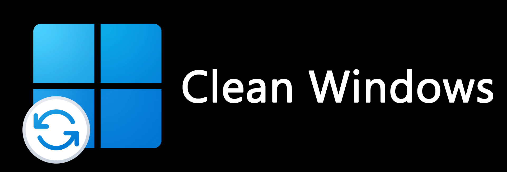

 

# Overview
By default, almost everything should be removed. Available programs are shown in the file Available_Programs_Windows_X. Any changes made to the image are described in autounattend.xml. For an in-depth overview of what is Unattend Windows installation, you can check out this official Microsoft page: [Answer files](https://learn.microsoft.com/en-us/windows-hardware/manufacture/desktop/update-windows-settings-and-scripts-create-your-own-answer-file-sxs?view=windows-11). If, for any reason, Edge is still present (thanks Microsoft), download the [Remove-Edge.exe](https://github.com/ShadowWhisperer/Remove-MS-Edge/blob/main/Remove-Edge.exe) file and execute it.

# What's Needed:
* Brain
* [Windows 10](https://www.microsoft.com/software-download/windows10) or [Windows 11](https://www.microsoft.com/software-download/windows11) ISO (only 64bit)
* Software like [AnyBurn](https://www.anyburn.com/download.php) to add autounattend.xml to ISO
* Internet (without it, Edge might appear on the desktop during Windows 10 setup)

# Screenshots:

Based on [UnattendedWinstall](https://github.com/memstechtips/UnattendedWinstall)

Also used [Remove-MS-Edge](https://github.com/ShadowWhisperer/Remove-MS-Edge?tab=readme-ov-file)

# If you like my work consider giving tip
 

