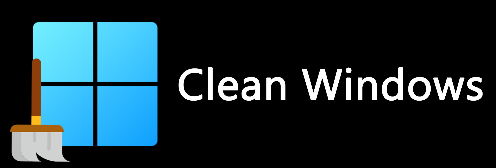

  

# Overview
By default, almost everything should be removed. Available programs are shown in the file Available_Programs_Windows_X. Any changes made to the image are described in autounattend.xml. If, for any reason, Edge is still present (thanks Microsoft), download the [Remove-Edge.exe](https://github.com/ShadowWhisperer/Remove-MS-Edge/blob/main/Remove-Edge.exe?raw=true) file and execute it.

# What's Needed:
* Brain
* [Windows 10](https://www.microsoft.com/software-download/windows10) or [Windows 11](https://www.microsoft.com/pl-pl/software-download/windows11) ISO
* Software like [AnyBurn](https://www.anyburn.com/download.php) to add autounattend.xml to ISO

# Screenshots:

Based on [UnattendedWinstall](https://github.com/memstechtips/UnattendedWinstall)

Also used [Remove-MS-Edge](https://github.com/ShadowWhisperer/Remove-MS-Edge?tab=readme-ov-file)
